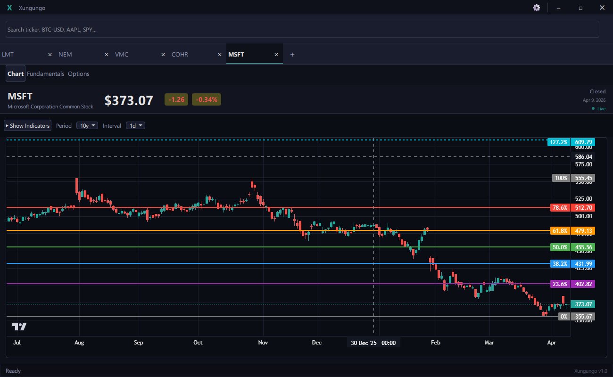
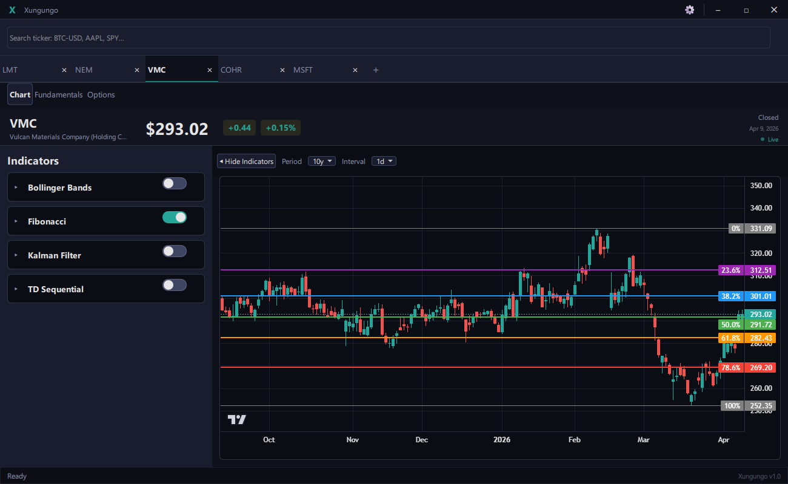

# Xungungo

**Xungungo** is a desktop application for real-time stock market analysis. View candlestick charts, technical indicators, and fundamental data for any ticker with a clean and fast interface.

---

## Download & Install

> **Requirements:** Windows 10/11 (64-bit). No Python or additional dependencies needed.

1. Download the installer from [Releases](https://github.com/XungungoMarkets/Xungungo2/releases)
2. Run `xungungo-setup-X.X.X.exe`
3. Follow the installer steps
4. Open Xungungo from the Start Menu or desktop shortcut

---

## What you can do with Xungungo

### Interactive Charts
View candlestick charts with zoom, panning, and multiple time intervals (1d, 1w, etc.). Data is fetched automatically from Yahoo Finance.

### Technical Indicators
Enable and disable indicators with a single click from the side panel:

| Indicator | What it does |
|-----------|-------------|
| **Bollinger Bands** | Shows volatility bands around the price |
| **Fibonacci** | Automatically detects swings and draws retracement levels |
| **Kalman Filter** | Smooths price noise with two curves (fast and slow) |
| **TD Sequential** | Tom DeMark's indicator for identifying exhaustion and reversal points |

### Multiple Tabs
Work with several tickers at the same time. Each tab is independent and saves its state when you close the app.

### Real-Time Price
The current price updates automatically from NASDAQ and Yahoo Finance.

### Fundamental Analysis
The **Analysis** tab shows company information: valuation metrics, shareholders, and analyst recommendations.

---

## How to search for a ticker

Click the search bar at the top and type the symbol or company name. The search bar suggests results automatically.

---

## Available intervals and periods

Use the controls at the top of the chart to change the candle interval (1d, 1w) and the historical period (1y, 5y, 10y, etc.).

---

## FAQ

**Do I need an internet connection?**
Yes, an internet connection is required to fetch price data and company information.

**Is the data real-time?**
The current price updates every 15 seconds. Candlestick history is downloaded when you open each ticker.

**What markets are available?**
Any ticker available on Yahoo Finance: US stocks, ETFs, indices, and more.

**Where is my configuration saved?**
In `C:\Users\YourUser\.xungungo\`. Your tabs and settings are restored automatically when you reopen the app.

---

## License

MIT — free for personal and commercial use.
